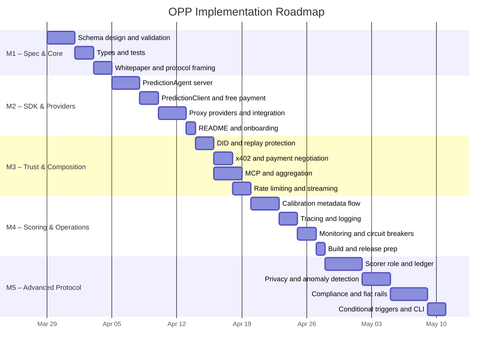

# Open Prediction Protocol — Roadmap

A milestone-based implementation plan for Open Prediction Protocol.

This roadmap is intentionally limited to `OPP`. It covers the schemas, SDK, trust metadata, payment abstraction, and composition primitives required for agent-to-agent forecast exchange.

It does **not** cover:

- forecast generation engines
- demand aggregation services
- end-user marketplace applications

Detailed technical decisions are logged in [decisions.md](file:///Users/michal/Open%20Prediction%20Protocol/.agents/decisions.md).

---

## Milestones

**Status legend:** `[x]` done, `[~]` in progress, `[ ]` not started

### Milestone 1 — Protocol Specification & Core Library
**Goal:** Define the protocol's canonical schemas and validation layer so forecast exchange can be implemented consistently across providers and consumers.

| # | Task | Purpose |
|---|---|---|
| [x] 1.1 | Project scaffold (`package.json`, `tsconfig`, directories) | Establish SDK foundation |
| [x] 1.2 | Write `spec/agent-card.schema.json` with prediction domains, trust metadata, pricing options, and compliance fields | Provider discovery and filtering |
| [x] 1.3 | Write `spec/prediction-request.schema.json` with domain, horizon, constraints, and privacy fields | Standardized request contract |
| [x] 1.4 | Write `spec/prediction-response.schema.json` with probabilities, provenance, freshness, audit metadata, and signatures | Standardized response contract |
| [x] 1.5 | Write `spec/prediction-lifecycle.md` for request, progress, completion, and failure states | Lifecycle semantics |
| [x] 1.6 | Create `src/types/index.ts` from the protocol schemas | Type-safe SDK surface |
| [x] 1.7 | Create `src/schemas/index.ts` with `ajv` validators | Runtime validation |
| [x] 1.8 | Write schema validation tests | Spec correctness |
| [x] 1.9 | Write `whitepaper.md` describing OPP scope, trust metadata, and composition patterns | Public protocol framing |

**Verification:** `pnpm run typecheck && pnpm test`

**Notes:**

- The schemas include hooks for trust, compliance, payments, and composition from the start to avoid later breaking changes.
- Infrastructure behind some optional fields ships in later milestones.

---

### Milestone 2 — Reference SDK & Bootstrap Providers
**Goal:** Prove that OPP works end-to-end by shipping a provider SDK, a consumer SDK, and a few simple providers that expose real forecasts through the protocol.

| # | Task | Purpose |
|---|---|---|
| [x] 2.1 | Build `PredictionAgent` server with Agent Card, JSON-RPC endpoints, and `/health` | Reference provider implementation |
| [x] 2.2 | Implement lifecycle state machine (`submitted` → `working` → `completed` / `failed`) | Consistent execution flow |
| [x] 2.3 | Build `PredictionClient` for discovery, request submission, and response validation | Reference consumer implementation |
| [x] 2.4 | Implement `FreePaymentProvider` for bootstrap and development use | Zero-friction early adoption |
| [x] 2.5 | Create `examples/weather-proxy.ts` that wraps an external weather API in OPP format | Reusable upstream forecast example |
| [x] 2.6 | Create `examples/crypto-proxy.ts` that wraps an external market-data API in OPP format | Second provider example |
| [x] 2.7 | Create `examples/sports-proxy.ts` that wraps an external sports API in OPP format | Third provider example |
| [x] 2.8 | Write lifecycle and client tests | SDK correctness |
| [x] 2.9 | Create `examples/integration-test.ts` for end-to-end smoke testing | End-to-end verification |
| [x] 2.10 | Write `README.md` with quick-start setup for providers and consumers | Developer onboarding |

**Verification:**
```bash
pnpm run example:weather
curl localhost:3001/.well-known/agent.json
curl localhost:3001/health
pnpm run integration
```

> [!IMPORTANT]
> **This is the first externally demoable artifact.** The key proof is that one consumer can discover multiple providers, request forecasts in one format, and consume responses without bespoke integrations.

---

### Milestone 3 — Trust, Payments & Composition
**Goal:** Add the protocol features that make provider trust, payment, and multi-provider composition practical.

| # | Task | Purpose |
|---|---|---|
| [x] 3.1 | Implement `src/security/identity.ts` for DID generation, signing, and verification | Provider identity and provenance |
| [x] 3.2 | Integrate freshness fields (`nonce`, `timestamp`, `recipientDid`) into signed responses | Replay protection |
| [x] 3.3 | Write identity and replay-protection tests | Security verification |
| [x] 3.4 | Implement `PaymentProvider` interface + `X402PaymentProvider` | Paid forecast access |
| [x] 3.5 | Integrate `@x402/express` and `@x402/fetch` | Machine-native payments |
| [x] 3.6 | Implement `src/payments/negotiator.ts` for payment method matching | Consumer/provider compatibility |
| [x] 3.7 | Build `src/mcp/prediction-mcp-server.ts` exposing OPP-backed tools | MCP integration surface |
| [x] 3.8 | Implement `src/client/aggregator.ts` for fan-out and merge across providers | Multi-provider composition |
| [x] 3.9 | Implement `src/security/rate-limiter.ts` for per-agent limits and spending caps | Operational control |
| 3.10 | Add SSE streaming (`tasks/sendSubscribe`) to server and client | Long-running request support |
| [x] 3.11 | Update examples to demonstrate signing, payment, and aggregation | Protocol ergonomics |

**Verification:**
```bash
pnpm test
# MCP Inspector shows OPP-backed tools
# Aggregation test queries multiple providers and merges the results
```

**Follow-up hardening for current M3 code:**

- Add a schema/type drift guard so changes in `spec/` and `src/types/` cannot silently diverge.
- Add a guard or generation path so MCP tool input schemas stay aligned with the canonical OPP request schema.
- Replace or formally standardize the current signature canonicalization with an RFC 8785-compatible approach before the signing format is treated as stable.

---

### Milestone 4 — Scoring Metadata, Observability & Production Hardening
**Goal:** Strengthen the protocol's trust layer and operational readiness without turning OPP into a forecasting engine.

| # | Task | Purpose |
|---|---|---|
| 4.1 | Implement `src/observability/metrics.ts` for Brier scoring utilities and domain-scoped calibration metadata | Standardized evaluation evidence |
| 4.2 | Implement prediction resolution flow (ground truth → score update → Agent Card refresh) | Calibration feedback loop |
| 4.3 | Implement `src/observability/tracing.ts` with OpenTelemetry spans | Protocol observability |
| 4.4 | Implement `src/observability/logger.ts` with correlation IDs | Structured logs |
| 4.5 | Implement `src/observability/golden-tasks.ts` for periodic known-answer checks | Operational trust monitoring |
| 4.6 | Implement `src/observability/confidence-monitor.ts` for drift and deviation signals | Quality degradation detection |
| 4.7 | Add circuit-breaker logic to reject degraded providers or route to fallback | Safer consumption |
| 4.8 | Write scoring, calibration, and monitoring tests | Validation |
| 4.9 | Configure `tsup` for dual ESM/CJS build + `src/index.ts` entry point | Packaging |
| 4.10 | Final verification: typecheck + all tests + integration + build | Release readiness |

**Verification:**
```bash
pnpm run typecheck && pnpm test && pnpm run integration && pnpm run build
```

---

### Milestone 5 — Advanced Verification, Privacy & Compliance
**Goal:** Complete the advanced protocol hooks for independent verification, sensitive requests, and regulated environments.

> [!NOTE]
> M5 is still protocol infrastructure. It adds stronger trust and governance capabilities, but it does not turn OPP into a separate service or marketplace application.

| # | Task | Purpose |
|---|---|---|
| 5.1 | Design scorer role schema (`spec/scorer-agent-card.schema.json`) | Independent verification role |
| 5.2 | Implement `src/scoring/ledger.ts` for append-only prediction records | Auditability foundation |
| 5.3 | Implement `src/scoring/consensus.ts` for pluggable multi-source resolution logic | Stronger verification path |
| 5.4 | Implement `src/security/query-privacy.ts` for blind or privacy-sensitive requests | Sensitive forecast support |
| 5.5 | Implement `src/security/anomaly-detector.ts` for prediction poisoning signals | Abuse detection |
| 5.6 | Implement `StripePaymentProvider` for fiat support | Broader payment compatibility |
| 5.7 | Implement `src/compliance/filter.ts` for consumer-side compliance filtering | Deployment policy support |
| 5.8 | Implement `src/compliance/audit-logger.ts` for structured audit events | Audit trail support |
| 5.9 | Implement `src/compliance/oversight.ts` for override / stop endpoints | Human oversight hooks |
| 5.10 | Document compliance profiles for selected regulated domains | Deployment guidance |
| 5.11 | Implement `src/client/conditional.ts` for conditional trigger subscriptions | Advanced composition |
| 5.12 | Create `packages/create-opp-agent/` CLI scaffolding tool | Faster adoption |

---

## Milestone Summary



| Milestone | Focus | Est. Effort |
|---|---|---|
| **M1** | Schemas, types, validation, protocol framing | Complete |
| **M2** | Reference SDK and demo providers | Complete |
| **M3** | Identity, payments, MCP integration, aggregation | In progress, identity, x402 payments, MCP tools, aggregation, rate limiting, and demo examples implemented |
| **M4** | Calibration metadata, observability, production hardening | ~5 days |
| **M5** | Advanced verification, privacy, compliance, scaffolding | ~10 days |

---

## Design Principles

1. **Protocol first.** OPP defines how agents exchange forecasts, not how forecasts are generated.
2. **Schema first, infrastructure later.** Optional fields for trust, payment, compliance, and composition appear early so the protocol surface can stabilize.
3. **Demoable at each step.** The roadmap prioritizes externally understandable demos, especially provider discovery, request/response interoperability, and multi-provider consumption.
4. **Trust strengthens in layers.** Early versions can expose provisional metadata; later versions add stronger independent verification paths.
5. **Composable by design.** OPP should support reusable upstream forecasts, dependency chains, aggregation, and private downstream composition.
